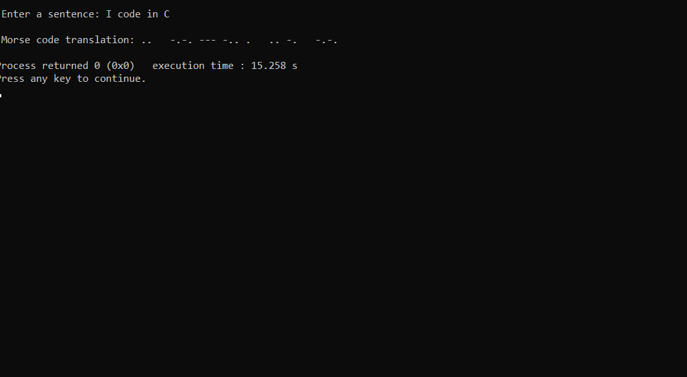

# Guess the Number Game
Welcome to the "Guess the Number" game! Test your guessing skills and try to find the hidden number within a chosen range and difficulty level.

## Description
Guess the Number is a simple command-line game where players guess a random number within a specified range. 
The game offers three difficulty levels to suit different skill levels.

## Features
- Choose between three difficulty levels: Easy, Medium, and Hard.
- Get hints based on the parity of the hidden number.
- Compete against your own high scores for each difficulty level.

## How to Play
1. Choose a difficulty level (Easy, Medium, or Hard).
2. The game will generate a random number within the selected difficulty's range.
3. Start guessing numbers within the range to find the hidden number.
4. The game will provide hints based on whether the hidden number is even or odd.
5. Keep guessing until you find the number!
