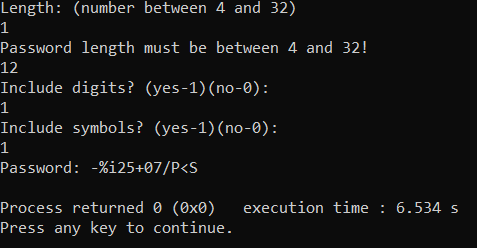

# Random Password Generator

This program written in C that allows users to generate random passwords based on their specified criteria.
Users can choose the length of the password (between 4 and 32 characters), decide whether to include digits, and opt to include special symbols.
The program utilizes randomization techniques to create secure and diverse passwords that can be used for various online accounts and services.

