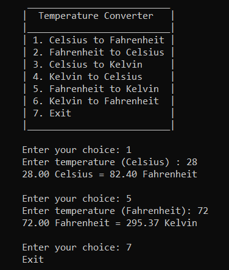

# Temperature Converter
A simple command-line program written in C that converts temperatures between Celsius, Fahrenheit, and Kelvin.

## Description
This temperature converter program allows users to convert temperatures between different units: Celsius, Fahrenheit, and Kelvin.
The user is presented with a menu to select the desired conversion type, input a temperature value, and then view the converted result.

## Conversion Options
- ### Celsius to Fahrenheit
- ### Fahrenheit to Celsius
- ### Celsius to Kelvin
- ### Kelvin to Celsius
- ### Fahrenheit to Kelvin
- ### Kelvin to Fahrenheit
