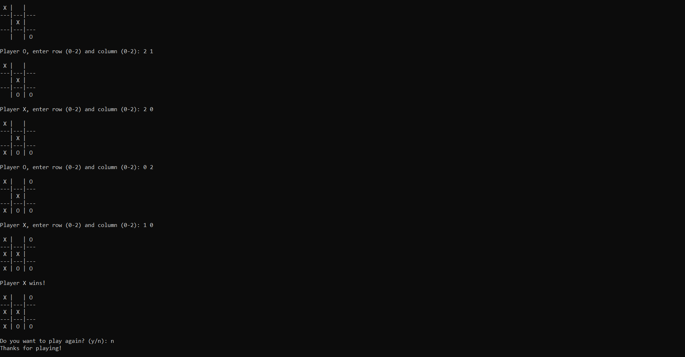

# Tic-Tac-Toe Game
Tic-Tac-Toe implementation in C with player input, win/draw checks, and option to play again

## Features

- Player vs Player gameplay
- Visual representation of the game board
- Win and draw checks
- Play Again option
- Basic command-line interface

## How to Play
1. Players take turns entering row and column numbers to place their 'X' or 'O' on the board.
2. The game will display the current state of the board after each move.
3. The first player to get three of their symbols in a row, column, or diagonal wins.
4. If all cells are filled and no player wins, the game ends in a draw.
5. Players can choose to play again after each game ends.

## Contributing
Feel free to fork this repository, make improvements, and submit pull requests. Contributions are welcome!

## Acknowledgments

- The idea and basic structure for this project were conceived during a period of exam preparation when I wanted a creative way to apply my programming skills.
- Implementing Tic-Tac-Toe provided an enjoyable diversion while studying.
- The Code::Blocks IDE facilitated the development process for this endeavor.
